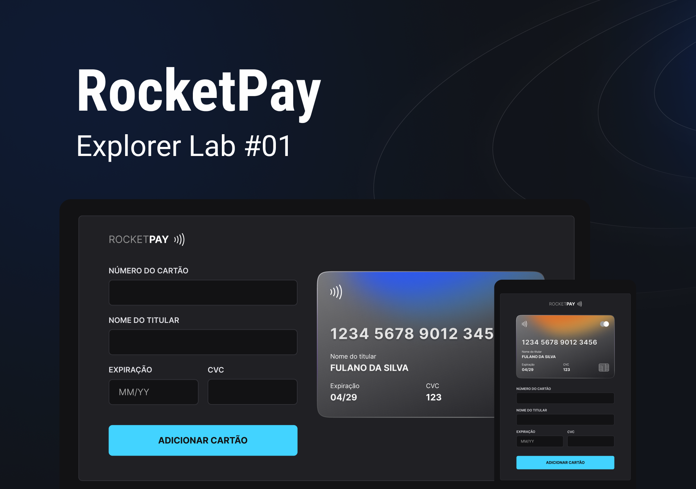
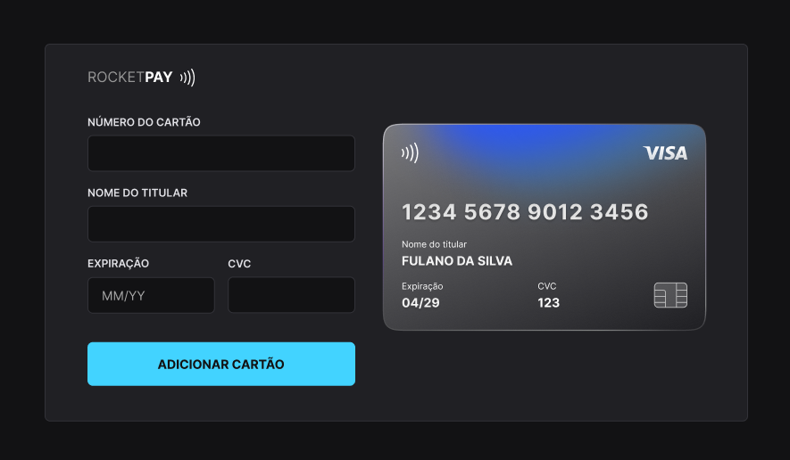

  

<h1 align="center">
  Explorer Lab | RocketPay
</h1>

<h4 align="center">
  Aplicativo desenvolvido durante o evento Explorer Lab #01 | JS DOM da <a href="https://www.rocketseat.com.br">Rocketseat</a> | de 17 a 20/10/2022
</h4>

  <a href="#-projeto">Projeto</a>   •
  <a href="#-tecnologias">Tecnologias</a>   •
  <a href="#-tela">Tela</a>   •
  <a href="#-layout">Layout</a>   •
  <a href="#memo-licença">Licença</a>

  
  
  

  

 

## 💻 Projeto

O Rocketpay é um componente que simula o formulário de preenchimento de cartão de crédito, onde é possível adicionar máscara aos inputs e atualizar elementos HTML via DOM.

## 🚀 Tecnologias

Esse projeto foi desenvolvido com as seguintes tecnologias:

- HTML e CSS
- JavaScript e JSON
- [Node e NPM](https://nodejs.org/)
- [Vite](https://vitejs.dev/)
- [iMask](https://imask.js.org)

## 🎨 Tela

  

## 🔖 Layout

Você pode visualizar o layout do projeto no [FIGMA](https://www.figma.com/file/FjgigMJvQhh07GU7BbXA9i/RocketPay-%7C-Evento-Explorer-Lab-%2301?node-id=0%3A1).

## :memo: Licença

Esse projeto está sob a licença MIT.